# Architecture & Module Dependency Map

## 🎨 Color Coordination Key

| Layer | Color | Hex | Purpose |
|-------|-------|-----|---------|
| **UI - Pages** | 🟦 Blue | `#3B82F6` | Route-level page components |
| **UI - Feature Components** | 🟣 Purple | `#8B5CF6` | Domain-specific feature modules |
| **UI - Shared/Foundation** | 🩵 Cyan | `#06B6D4` | Reusable UI primitives & layouts |
| **XRPL Integration** | 🟠 Orange | `#F97316` | Blockchain connectivity & explorer links |
| **Security / RBAC** | 🔴 Red | `#EF4444` | Role-based access, permissions |
| **Data - Mock/Client State** | 🟡 Yellow | `#EAB308` | Mock data, local state management |
| **Data - Supabase (Future)** | 🟢 Green | `#22C55E` | Database, auth, real-time subscriptions |
| **Types / Contracts** | ⚪ Gray | `#6B7280` | TypeScript interfaces & type definitions |
| **Reporting & Audit** | 🟤 Amber | `#D97706` | Logs, reports, compliance tracking |
| **Services / API (Future)** | 🩷 Pink | `#EC4899` | Edge functions, external API integrations |

---

## Module Dependency Map

```mermaid
flowchart TB
    subgraph LEGEND["🎨 COLOR KEY"]
        direction LR
        L1["🟦 UI Pages"]
        L2["🟣 Feature Components"]
        L3["🩵 Shared/Foundation"]
        L4["🟠 XRPL Integration"]
        L5["🔴 Security/RBAC"]
        L6["🟡 Mock Data"]
        L7["🟤 Reporting/Audit"]
        L8["⚪ Types/Contracts"]
    end

    subgraph PAGES["📄 PAGES (Routes)"]
        style PAGES fill:#3B82F6,stroke:#1E40AF,color:#fff
        Index["Index.tsx"]
        Tokens["Tokens.tsx"]
        TokenCreate["TokenCreate.tsx"]
        Wallets["Wallets.tsx"]
        Escrows["Escrows.tsx"]
        EscrowDetails["EscrowDetailsPage.tsx"]
        Checks["Checks.tsx"]
        CheckDetails["CheckDetailsPage.tsx"]
        PaymentChannels["PaymentChannels.tsx"]
        ChannelDetails["ChannelDetailsPage.tsx"]
        AMM["AMM.tsx"]
        PoolDetails["PoolDetailsPage.tsx"]
        SmartContracts["SmartContracts.tsx"]
        ContractDetails["ContractDetailsPage.tsx"]
        BatchTransactions["BatchTransactions.tsx"]
        BatchBuilder["BatchBuilderPage.tsx"]
        BatchDetails["BatchDetailsPage.tsx"]
        Investors["Investors.tsx"]
        InvestorProfile["InvestorProfile.tsx"]
        ReportsLogs["ReportsLogs.tsx"]
        KnowledgeBase["KnowledgeBase.tsx"]
    end

    subgraph FEATURES["🧩 FEATURE COMPONENTS"]
        style FEATURES fill:#8B5CF6,stroke:#6D28D9,color:#fff
        
        subgraph TOKEN_MODULE["Token Management"]
            TokenDashboard["TokenDashboard"]
            TokenDetails["TokenDetails"]
            TokenTable["TokenTable"]
            TokenFilters["TokenFilters"]
            TokenWizard["TokenWizard"]
            AuditLog["AuditLog"]
        end
        
        subgraph WALLET_MODULE["Wallet Management"]
            WalletDashboard["WalletDashboard"]
            WalletCard["WalletCard"]
            MultiSignConfig["MultiSignConfigPanel"]
            MultiSignQueue["MultiSignApprovalQueue"]
            SignerCard["SignerCard"]
            SigningModal["SigningModal"]
        end
        
        subgraph ESCROW_MODULE["Escrow Management"]
            EscrowDashboard["EscrowDashboard"]
            EscrowDetailsComp["EscrowDetails"]
            EscrowTable["EscrowTable"]
            EscrowTimeline["EscrowTimeline"]
            CreateEscrowDialog["CreateEscrowDialog"]
        end
        
        subgraph CHECK_MODULE["Check Management"]
            ChecksDashboard["ChecksDashboard"]
            CreateCheckDialog["CreateCheckDialog"]
        end
        
        subgraph CHANNEL_MODULE["Payment Channels"]
            PaymentChannelDashboard["PaymentChannelDashboard"]
            CreateChannelDialog["CreateChannelDialog"]
        end
        
        subgraph AMM_MODULE["AMM / Liquidity"]
            AMMDashboard["AMMDashboard"]
            CreatePoolDialog["CreatePoolDialog"]
        end
        
        subgraph CONTRACT_MODULE["Smart Contracts"]
            ContractsDashboard["ContractsDashboard"]
            ContractDetailsComp["ContractDetails"]
            CreateContractDialog["CreateContractDialog"]
            ContractCallDialog["ContractCallDialog"]
        end
        
        subgraph BATCH_MODULE["Batch Transactions"]
            BatchDashboard["BatchDashboard"]
            BatchBuilder["BatchBuilder"]
            BatchDetailsComp["BatchDetails"]
            TransactionConfigForm["TransactionConfigForm"]
        end
        
        subgraph INVESTOR_MODULE["Investor Management"]
            InvestorOnboardingApp["InvestorOnboardingApp"]
            InvestorList["InvestorList"]
            InvestorTable["InvestorTable"]
            InvestorDetailsComp["InvestorDetails"]
            InvestorProfilePage["InvestorProfilePage"]
        end
        
        subgraph TOKENIZATION_MODULE["Tokenization Admin"]
            TokenizationAdminApp["TokenizationAdminApp"]
            ProjectList["ProjectList"]
            ProjectDetails["ProjectDetails"]
            TokenLifecyclePanel["TokenLifecyclePanel"]
            StatusStepper["StatusStepper"]
        end
        
        subgraph KB_MODULE["Knowledge Base"]
            KnowledgeBaseApp["KnowledgeBaseApp"]
            KBCategoryCard["KBCategoryCard"]
            KBEntryList["KBEntryList"]
            KBEntryDetail["KBEntryDetail"]
            KBProposalDialog["KBProposalDialog"]
        end
    end

    subgraph REPORTING["📊 REPORTING & AUDIT"]
        style REPORTING fill:#D97706,stroke:#B45309,color:#fff
        OverviewDashboard["OverviewDashboard"]
        TransactionLedger["TransactionLedger"]
        TaxCenter["TaxCenter"]
        ReportsLibrary["ReportsLibrary"]
        AuditLogViewer["AuditLogViewer"]
        AuditLogDrawer["AuditLogDrawer"]
    end

    subgraph SHARED["🔧 SHARED COMPONENTS"]
        style SHARED fill:#06B6D4,stroke:#0891B2,color:#fff
        AppSidebar["AppSidebar"]
        NavLink["NavLink"]
        Header["Header"]
        StatusBadge["StatusBadge"]
        UI_Components["UI Components (shadcn)"]
    end

    subgraph XRPL["⛓️ XRPL INTEGRATION"]
        style XRPL fill:#F97316,stroke:#EA580C,color:#fff
        xrplExplorer["xrplExplorer.ts"]
        ExplorerDropdown["ExplorerDropdown"]
        ExplorerLinkBadge["ExplorerLinkBadge"]
        mptFlags["mptFlags.ts"]
        pricingCalculator["pricingCalculator.ts"]
    end

    subgraph DATA["💾 DATA LAYER"]
        style DATA fill:#EAB308,stroke:#CA8A04,color:#000
        mockTokens["mockTokens.ts"]
        mockWallets["mockWallets.ts"]
        mockEscrows["mockEscrows.ts"]
        mockChecks["mockChecks.ts"]
        mockChannels["mockPaymentChannels.ts"]
        mockPools["mockAMMPools.ts"]
        mockContracts["mockContracts.ts"]
        mockBatches["mockBatches.ts"]
        mockInvestors["mockInvestors.ts"]
        mockProjects["mockProjects.ts"]
        mockReports["mockReportsLogs.ts"]
        mockKB["mockKnowledgeBase.ts"]
        mockPending["mockPendingTransactions.ts"]
    end

    subgraph TYPES["📝 TYPE DEFINITIONS"]
        style TYPES fill:#6B7280,stroke:#4B5563,color:#fff
        tokenTypes["token.ts"]
        escrowTypes["escrow.ts"]
        checkTypes["check.ts"]
        channelTypes["paymentChannel.ts"]
        ammTypes["amm.ts"]
        contractTypes["smartContract.ts"]
        batchTypes["batchTransaction.ts"]
        investorTypes["investor.ts"]
        tokenizationTypes["tokenization.ts"]
        kbTypes["knowledgeBase.ts"]
        reportTypes["reportsAndLogs.ts"]
        multiSignTypes["multiSign.ts"]
        auditTypes["tokenAudit.ts"]
        pricingTypes["tokenPricing.ts"]
        mptTypes["mptTransactions.ts"]
    end

    %% Page Dependencies
    Index --> AppSidebar
    Tokens --> TokenDashboard
    TokenCreate --> TokenWizard
    Wallets --> WalletDashboard
    Escrows --> EscrowDashboard
    EscrowDetails --> EscrowDetailsComp
    Checks --> ChecksDashboard
    CheckDetails --> ChecksDashboard
    PaymentChannels --> PaymentChannelDashboard
    ChannelDetails --> PaymentChannelDashboard
    AMM --> AMMDashboard
    PoolDetails --> AMMDashboard
    SmartContracts --> ContractsDashboard
    ContractDetails --> ContractDetailsComp
    BatchTransactions --> BatchDashboard
    BatchBuilder --> BatchBuilder
    BatchDetails --> BatchDetailsComp
    Investors --> InvestorOnboardingApp
    InvestorProfile --> InvestorProfilePage
    ReportsLogs --> OverviewDashboard
    KnowledgeBase --> KnowledgeBaseApp

    %% Feature to Data Dependencies
    TokenDashboard --> mockTokens
    TokenDetails --> mockTokens
    WalletDashboard --> mockWallets
    EscrowDashboard --> mockEscrows
    ChecksDashboard --> mockChecks
    PaymentChannelDashboard --> mockChannels
    AMMDashboard --> mockPools
    ContractsDashboard --> mockContracts
    BatchDashboard --> mockBatches
    InvestorOnboardingApp --> mockInvestors
    TokenizationAdminApp --> mockProjects
    KnowledgeBaseApp --> mockKB
    OverviewDashboard --> mockReports

    %% Feature to Type Dependencies
    TokenDashboard --> tokenTypes
    WalletDashboard --> multiSignTypes
    EscrowDashboard --> escrowTypes
    ChecksDashboard --> checkTypes
    PaymentChannelDashboard --> channelTypes
    AMMDashboard --> ammTypes
    ContractsDashboard --> contractTypes
    BatchDashboard --> batchTypes
    InvestorOnboardingApp --> investorTypes
    TokenizationAdminApp --> tokenizationTypes
    KnowledgeBaseApp --> kbTypes

    %% XRPL Dependencies
    TokenDetails --> xrplExplorer
    TokenDetails --> ExplorerLinkBadge
    TokenWizard --> mptFlags
    TokenWizard --> pricingCalculator

    %% Shared Dependencies
    TokenDashboard --> UI_Components
    WalletDashboard --> UI_Components
    EscrowDashboard --> UI_Components
    AppSidebar --> NavLink
```

---

## Quick Reference

### Layer Purpose Guide

| When You're Working On... | Use This Color | Examples |
|---------------------------|----------------|----------|
| Adding a new route/page | 🟦 Blue | `pages/NewFeature.tsx` |
| Building feature UI | 🟣 Purple | `components/feature/FeatureDashboard.tsx` |
| Creating reusable components | 🩵 Cyan | `components/shared/DataTable.tsx` |
| XRPL blockchain integration | 🟠 Orange | `lib/xrplClient.ts` |
| Role/permission logic | 🔴 Red | `hooks/usePermissions.ts` |
| Mock data or local state | 🟡 Yellow | `data/mockUsers.ts` |
| Database/Supabase queries | 🟢 Green | `services/userService.ts` |
| TypeScript interfaces | ⚪ Gray | `types/user.ts` |
| Audit logs, reports | 🟤 Amber | `components/reports/AuditTrail.tsx` |
| Edge functions, APIs | 🩷 Pink | `functions/sendEmail.ts` |

### Viewing the Diagram

1. **GitHub**: Renders automatically in markdown preview
2. **Export**: Copy the Mermaid code to [mermaid.live](https://mermaid.live) for PNG/SVG/PDF export
3. **VS Code**: Install "Markdown Preview Mermaid Support" extension

---

## Architecture Principles

1. **Pages are thin** - Route components delegate to feature dashboards
2. **Features are self-contained** - Each module owns its components, hooks, and state
3. **Shared components are generic** - No business logic in `/ui` or `/shared`
4. **Types define contracts** - All data shapes live in `/types`
5. **Data layer is swappable** - Mock data can be replaced with Supabase services
